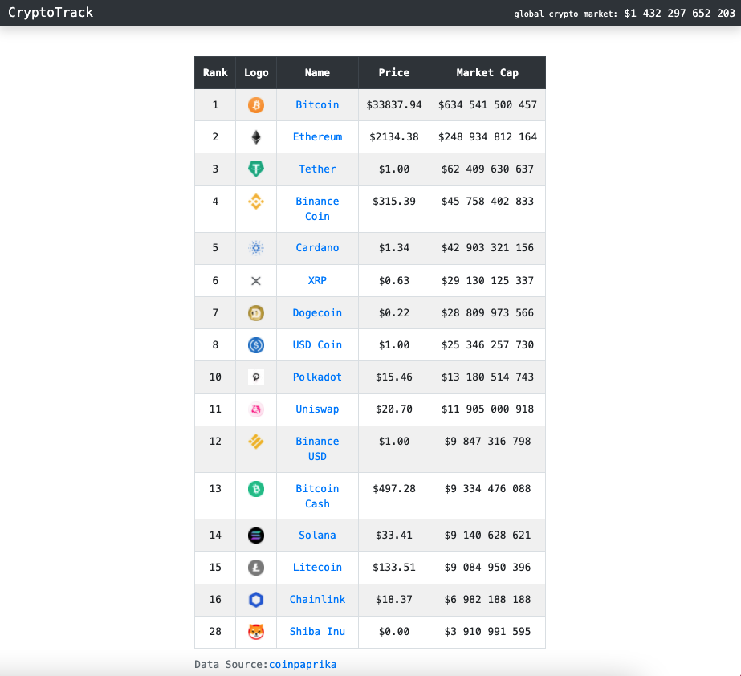

# Cryptotrack
Blockchain website that tracks the prices and market caps of popular cryptocurrencies 

**Steps to run application:**
1. Open Terminal
2. $ git clone https://github.com/rkchan77/cryptotrack
3. Open your IDE + navigate to src/components/App.js
4. In your browser go to https://english.api.rakuten.net/lbraciszewski/api/coinpaprika1
5. Create an account and get API key
6. In App.js go to line 36 and enter API key 
7. In Terminal, cd cryptotrack
8. npm install
9. npm run start 
10. Open localhost:3000 in your browser if application does not open automatically
 

**Preview:** 

